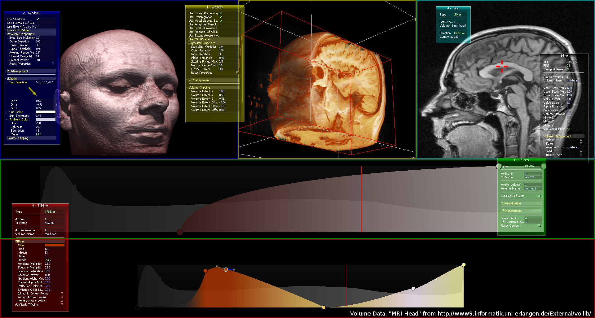

# Voraca
Volume raycasting powered by OpenGL 3.3 core profile. This project was part of my bachelor thesis in 2014!

## Features
* Loading of DAT and PVM (uncompressed) files
* Realtime manipulation of 2D transferfunction via mouse
* Bezier curve interpolation between set points in transferfunction
* Multiply shading parameters per point in transferfunction
* Local lighting via sun
* Acceleration techniques (Early Ray Termination, Empty Space Skipping...)
* Spherical reflection
* Volume clipping with box
* Launch file, transferfunction and raycaster settings can be saved as XML

## Screenshot

## Videos
* [Showcase: Part 1](https://www.youtube.com/watch?v=sM18a2M5_FM)
* [Showcase: Part 2](https://www.youtube.com/watch?v=ZcDHNtyZ3es)
* [Tutorial: Import DAT](https://www.youtube.com/watch?v=rirZg5DN4OE)

## HowTo
Just run CMake to create a project for your IDE and compile it. Should work on Windows and Linux with OpenGL 3.3 core profile compatible graphics hardware. Tested under:
* Windows 10, Visual Studio 2015, 64bit project, AMD Radeon HD 7950
* Arch Linux, GCC 5.x, 64bit project, Nvidia Geforce 860m running with optirun

## Dependencies
* GLM: http://glm.g-truc.net/0.9.7/index.html (MIT license chosen)
* picoPNG: http://lodev.org/lodepng
* GLFW3: http://www.glfw.org
* AntTweakBar 1.16: http://anttweakbar.sourceforge.net (included in externals but renamed gitignore to upload binaries)
* RapidXML 1.13: http://rapidxml.sourceforge.net (Boost Software License chosen)

## TODO
* Warnings in GCC (all about char* conversion)
* Does not render correctly on linux with intel gpu
* 32bit support for Windows / Visual Studio
* Importance volume does not use complete information of volume if volume resolution % downscale !=0
* Histogram is one pixel too wide
* Shader::draw line 174: Reset of textureSlotCounter only works as expected if all textures assigned once or all textures assigned each frame. Mixing would break it.

## Acknowledgements
* Thanks to Andre Taulien for supporting in the Linux compatibility!
* Thanks to Nils Höhner for supporting in the MacOS compatibility! (not given right now)
